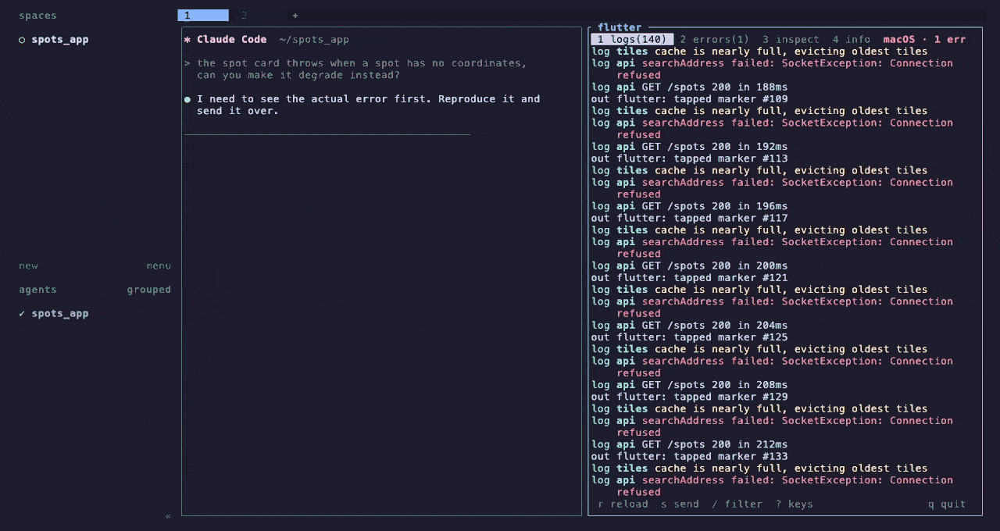

# herdr-flutter

A herdr sidebar for a running Flutter app: its logs, its errors, its widget tree,
its HTTP traffic, and one key to hand any of that to the agent working beside it.



It attaches to the Dart VM Service of a `flutter run` that is already going. It
never launches or owns the app, so the run keeps living in its own pane with its
own output, and closing the sidebar changes nothing about it.

## What it does

- **logs**: stdout, stderr, `dart:developer` records and every `Flutter.Error`,
  in one stream in the order they happened. An error shows its summary in red
  with its `file:line` and what the framework was doing under it, and unfolds
  in place on `enter` to the full console rendering, without leaving the run.
  `/` filters, `exc:` narrows to the errors
- **inspect**: the widget tree, summary or full, with the source location of each
  widget from the project, its text preview, and its properties on demand
- **net**: the HTTP calls the app makes, with their status, duration and size, and
  for each one its timings, its headers and its bodies, JSON pretty-printed
- **restart**: hot reload and hot restart through the VM Service, so no keystroke
  is sent anywhere and the run pane does not need focus
- **toggles**: paint guides, repaint rainbow, performance overlay, debug banner,
  oversized images, select-widget mode
- **send**: write the current error, log tail, widget subtree or request to a
  report and put a one-line pointer in the agent's input, then focus it

## Requirements

- herdr 0.7 or later
- macOS or Linux, on x86_64 or arm64
- Flutter, for the app you are debugging. The sidebar itself ships as a prebuilt
  binary, so no Dart SDK is needed to install it.

## Install

```sh
herdr plugin install ablause/herdr-flutter
```

The build step downloads the prebuilt binary for the platform from the release
matching the manifest version, and verifies its checksum.

For a local checkout, `herdr plugin link` skips build steps, so build it yourself:

```sh
git clone https://github.com/ablause/herdr-flutter ~/Projects/herdr-flutter
cd ~/Projects/herdr-flutter
bash herdr/install.sh --source
herdr plugin link .
```

Then bind the toggle in `~/.config/herdr/config.toml`:

```toml
[[keys.command]]
key = "prefix+d"                        # d for debug
type = "plugin_action"
command = "ablause.herdr-flutter.toggle"
```

The actions can also be invoked directly:

```sh
herdr plugin action invoke toggle --plugin ablause.herdr-flutter
```

## How it finds the app

`flutter run` prints one line when the app is up:

```
A Dart VM Service on iPhone 17 is available at: http://127.0.0.1:64095/gmHGW1_v0J4=/
```

The sidebar reads the scrollback of the panes around it, newest announcement
first, same tab before same workspace before the rest. Agent panes, its own pane
and other herdr-flutter sidebars are never read.

Finding an app opens no connection: discovery only reads text, and attaching is
the only thing that dials, with a deadline so a stale port forward fails instead
of hanging. An address that did not answer is left alone until you ask for a
rescan, rather than being reopened on every pass.

So the app can run anywhere: a plain pane, a wrapper of your choosing, a
`flutter run` you started before the sidebar existed. `D` lists what was found
and switches between several running apps. If the app does not live in a herdr
pane at all, point the sidebar at it with `service_uri` in the plugin config.

## Keys

| key | does |
| --- | --- |
| `1` … `4`, `tab` | switch view |
| `j` `k`, arrows, `pgup` `pgdn`, `g` `G` | move the cursor |
| `enter`, double click | unfold an error, open a detail, fold a tree node |
| `r` / `R` | hot reload / hot restart |
| `s` | send what is on screen to the agent |
| `y` | copy the same capture to the clipboard |
| `t` | debug toggles |
| `u` | refresh (widget tree, traffic, or rediscovery from `info`) |
| `f` | summary tree or full tree |
| `x` | select the widget in the running app |
| `d` | properties of the selected widget |
| `/` | filter the log, `exc:` for errors alone |
| `c` | clear the log or the recorded traffic |
| `D` | pick an app to attach to |
| `?` `q` | keys, quit |

The mouse works too: click a tab to switch view, click a row in the log,
inspector, network or app lists to select it, click a debug toggle to flip it,
and use the wheel to move the selection.

Clicking a row twice does what `enter` does to it: it unfolds an error, opens a
request, folds a widget, attaches to the app. A terminal reports each button
press and knows nothing of double clicks, so the pairing is the sidebar's: the
same row, twice, within 400 ms.

Capturing the mouse is what takes click-drag text selection away from the pane.
Most terminals still select with shift held down, `y` copies the current capture
to the clipboard anyway, and `mouse = false` in the plugin config gives selection
back and leaves the keyboard in charge.

## Sending to the agent

`s` writes a markdown report under
`~/.local/state/herdr/plugins/ablause.herdr-flutter/reports/` and puts a single
line in the agent's input naming it, without submitting. You add what you want and
press enter yourself.

It is a file and a pointer rather than a paste because a stack trace with a widget
subtree runs to hundreds of lines, and because a multi-line paste would submit
itself on the first newline. The last fifty reports are kept.

The target is the sole agent in the sidebar's own tab, otherwise the sole agent in
its workspace. Zero or several candidates refuse the send and say so; the report is
still written, and its path is in the message.

## The network view

`3` lists the HTTP calls the app makes, newest last, and follows the newest one
until you move off it. `enter` opens one: its timings, its headers, and its
request and response bodies, with JSON pretty-printed whatever content type the
server claimed. `c` clears the recording, in the app as well as in the sidebar.

Three things are worth knowing about what it can see:

- it reads `dart:io`'s profiler, so it covers `package:http`, dio, and anything
  else built on `HttpClient`. A platform view, a native SDK or an image fetched
  by the engine makes no appearance.
- **nothing that happened before the sidebar attached is there.** The profiler is
  off by default and keeps no history, so the list starts at the moment you
  attached, and a hot restart starts it over.
- recording keeps every request and response body in the app's memory until it is
  cleared. An app that streams large payloads may prefer `http_profiling = false`,
  which gives up the view and asks the app for nothing.

The list is polled once a second, and only while the view is on screen. The app
records either way, so nothing is lost by looking away.

## Configuration

`$HERDR_PLUGIN_CONFIG_DIR/config.toml`, which is
`~/.config/herdr/plugins/config/ablause.herdr-flutter/config.toml`:

```toml
toggle_placement = "split"   # split | overlay | zoomed | tab
toggle_direction = "right"   # right | down, split only
auto_open = false            # open on worktree.created
service_uri = ""             # attach here instead of scanning panes
log_limit = 5000             # lines kept in memory
follow_logs = true           # stick to the newest line
pane_lines = 3000            # scrollback read per pane while discovering
mouse = true                 # clickable tabs and rows, at the cost of selection
http_profiling = true        # record the app's HTTP traffic on attach
```

Unknown keys and out-of-range values are errors, not silently ignored lines: every
entry point validates the file before doing anything, so a typo is reported once
instead of changing behaviour quietly.

## Limits

- No breakpoints, no stepping, no expression evaluation. Those need a source view
  and a frame stack, which is a different and much larger tool; DevTools and the
  IDE debuggers already do it well.
- No CPU profiler, no memory view, no frame timeline.
- It does not start the app. This was built and then removed: without breakpoints
  a launch key replaces typing a command in a pane, which up-arrow and enter
  already do in two keystrokes, and it dragged in a confirmation screen, a
  placement question and a heuristic for finding the right package in a monorepo.
  The sidebar attaches to a run; the pane owns it.
- The widget inspector is a debug-build feature. A profile or release build shows
  logs and errors but no tree.
- Structured errors are the framework default on non-web debug builds. On the web
  they are not sent, so no error line appears there. Where they are on, the event
  is the *only* channel: enabling them replaces `FlutterError.presentError` with
  the reporter that posts the event, so a framework error reaches neither stdout
  nor stderr. That is why errors are a line in the log rather than an echo of one.
- Errors live in the log and age out of it with everything else, at `log_limit`
  lines. There was once a list of their own that could not be evicted; it went
  because two places to look for one run is worse than losing the oldest error of
  a five thousand line session. `exc:` brings back the view of them alone.
- Reload and restart need the `flutter run` that owns the app to be alive, since it
  is the one that recompiles. If it never registered its services on the
  connection, the sidebar falls back to sending the `r` or `R` keystroke to the
  owning pane, and says so.

## Development

```sh
dart test        # 110 tests, no app or herdr needed
dart analyze
bash herdr/install.sh --source                      # rebuild the binary
./bin/herdr-flutter --probe --json                  # attach once, report, exit
./bin/herdr-flutter --probe --json --uri=http://…   # against a specific app
```

Use `--source`: the plain `install.sh` prefers the release asset and would
overwrite a locally built binary.

Releases are prepared by release-please from the conventional commits on `main`
and cut by merging the pull request it keeps open; see `docs/RELEASING.md`.

`--probe` is the non-interactive check: it does the whole discovery, attach,
stream and inspector path and prints what it saw, which is how the protocol side
of this plugin was verified. See `docs/api-notes.md` for the verified facts it
relies on.
